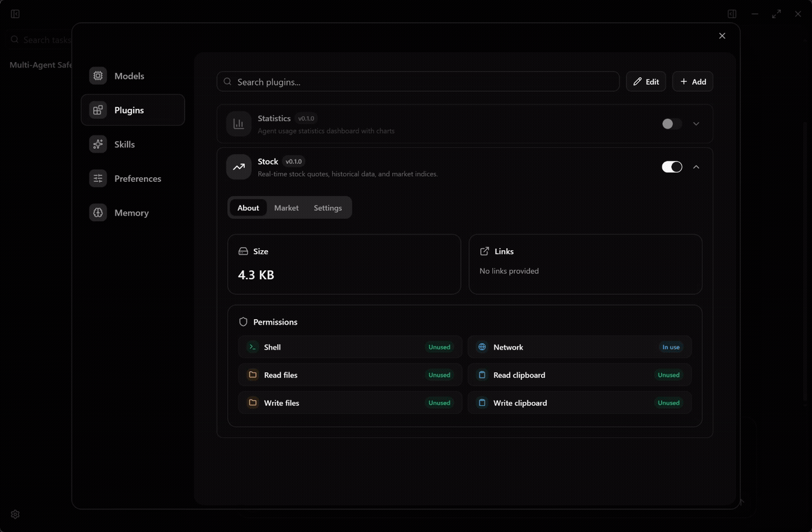

<p align="center">
  
</p>

<h3 align="center">Flint</h3>

<p align="center">
  <strong>AI for everyone</strong>
</p>

<p align="center">
  <a href="https://github.com/TheFlintAI/Flint/stargazers"></a>
  <a href="LICENSE"></a>
</p>

<p align="center">
  <a href="README.zh.md">中文</a>
</p>


## What is Flint?

Flint is a multi-agent application that lets you solve the hardest problems in the simplest way.

<p align="center">
  
</p>

## Features

- **Multi-Agent**: Agents autonomously plan, divide work, and collaborate to solve complex problems.
- **Modular**: A powerful plugin system — plugin authors can customize the UI, hook into multi-agent workflows, and equip AI with richer tools for a wider range of scenarios.
- **Economical**: Full-stack context optimization dramatically improves token cache hit rates, saving costs at every layer.
- **Simple**: Only the features you actually need — streamlined to essentials, ready to use out of the box.
- **Open**: Compatible with all major model providers. Freedom to choose the models you prefer.
- **Lightweight**: Built on Tauri — minimal memory footprint, maximum performance.

## Plugins

Flint was designed with extensibility in mind from day one. For example, the built-in **Stock Plugin** can independently render market dashboards, equip agents with financial analysis tools, and seamlessly integrate real-time market insights into your workflow.

<p align="center">
  
</p>

## Getting Started

```bash
git clone https://github.com/flint/flint.git
cd flint
bun install
bun run dev
```

Requires [Bun](https://bun.sh) and [Rust](https://rustup.rs).

## Contact

Email: **formetaohy@gmail.com**

## License

Flint is free and open-source under [GPL](LICENSE).
